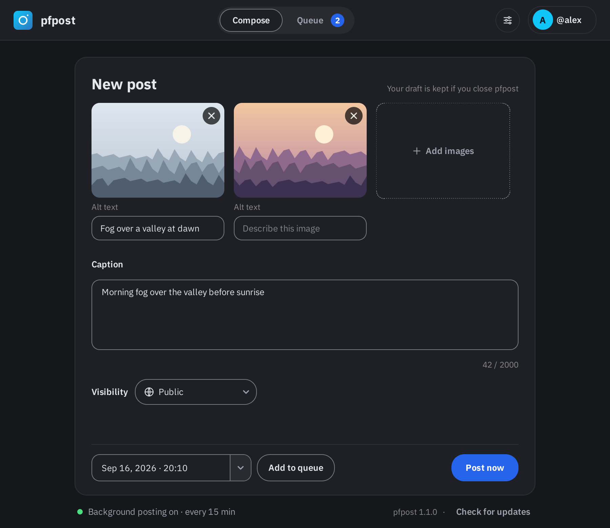
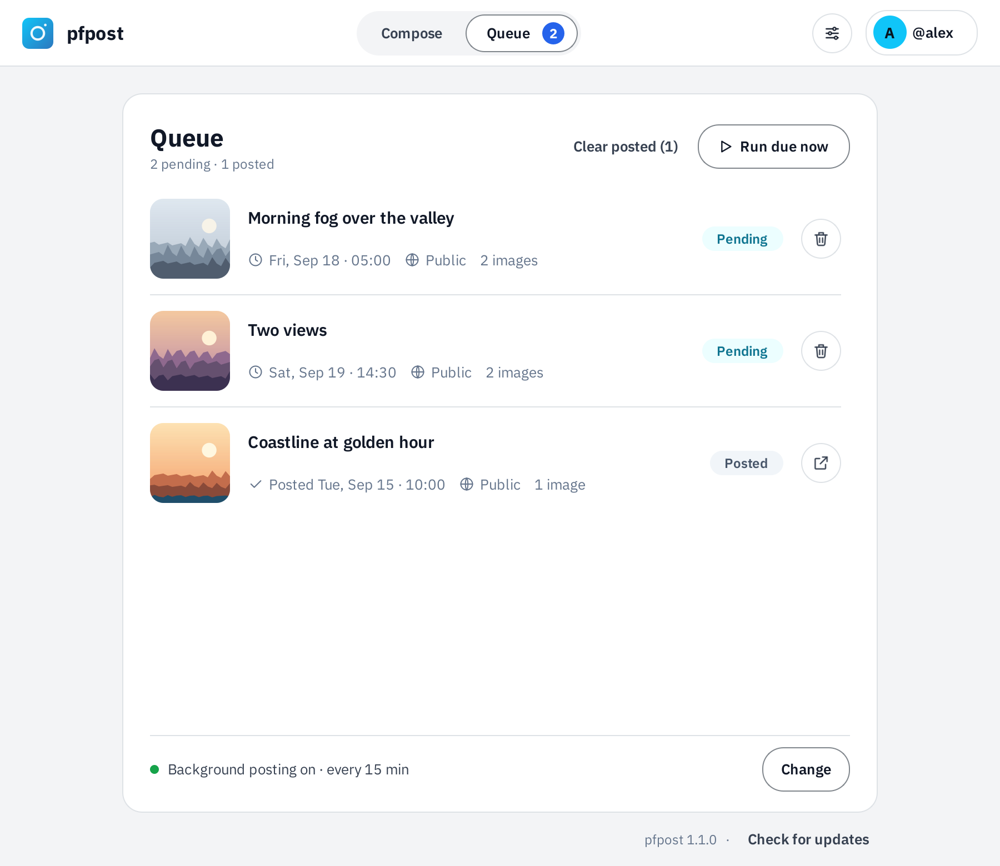

# pfpost

Post to Pixelfed from the command line or a desktop app, now or on a schedule.

| Compose | Queue |
|---|---|
|  |  |

<sub>pfpost in dark and light mode, following your Windows setting. Sample images and account.</sub>

Works with any Mastodon-compatible Pixelfed instance. Credentials go into your
operating system's credential store, never into a file in the clear. The core
is pure standard library; the only dependencies are `keyring` for cross-platform
secret storage and `PySide6` for the optional GUI.

Verified end to end against **gram.social** (Pixelfed 0.12.9) — registration,
authorization, and live posting from both the CLI and the desktop app —
including automatic handling of instances whose web server caps request header
size.

> **Built with AI.** pfpost's code, tests and documentation were written by
> Claude, an AI model from Anthropic, directed and tested by the maintainer. The
> app itself uses no AI. See [AI disclosure](#ai-disclosure).

## Why it works this way

Pixelfed has **no server-side post scheduling** — there is no `scheduled_at`
parameter on `POST /api/v1/statuses`. Anything that "schedules" a Pixelfed post
is really a local queue plus a clock. That is what `queue` plus the system
scheduler (Task Scheduler on Windows, launchd on macOS, a systemd timer or cron
on Linux) provide here.

Posting is always two steps: upload each file to `/api/v1/media` to get an id,
then create the status referencing those ids. Pixelfed requires at least one
media attachment — text-only posts are rejected.

## Install

Prebuilt Windows executables need no Python at all:

| | |
|---|---|
| `pfpost-gui.exe` | the desktop app |
| `pfpost.exe` | the command line, and what the scheduled task runs |

Keep both in the same folder — enabling background posting looks for its sibling
so the task runs without flashing a console window.

To build them yourself, or to run from source, use a virtual environment in
the project folder. It keeps pfpost's packages with the project, so installing,
upgrading or replacing your system Python can't break it:

```
python -m venv .venv
.venv\Scripts\python.exe -m pip install -r requirements-build.txt
.venv\Scripts\python.exe build.py
```

Run the app and tests the same way, e.g. `.venv\Scripts\python.exe pfpost.py gui`.
There's no need to activate the environment. If your Python version changes,
delete `.venv` and run the first two lines again.

The build requirements pin the packaging toolchain used for release binaries.
`build.py` also gives PyInstaller a minimal native-library search path so Qt
DLLs from another SDK or developer shell cannot be bundled by accident.

Release binaries come from CI, not a local build. Pushing a tag that matches
`__version__` in `pfpost/__init__.py` (e.g. `v1.2.0`) runs the same tests,
build and smoke test as every pull request, then attaches those exact files to
a draft release with their checksums. Write the notes and publish it from the
Releases page.

`keyring` is strongly recommended — without it pfpost falls back to Windows
DPAPI, and on other platforms it will refuse to store credentials rather than
write them somewhere insecure. `PySide6` is only needed for the GUI.

## Setup

Examples below use the downloaded executables. From source, use
`.venv\Scripts\python.exe pfpost.py` in place of `pfpost.exe`, and
`.venv\Scripts\python.exe pfpost.py gui` in place of `pfpost-gui.exe`.

```
pfpost.exe register --instance your.instance
pfpost.exe auth
```

`register` hits `/api/v1/apps`, which needs no authentication and returns the
client secret directly, so there is no value to transcribe. `auth` opens your
browser, you approve, and a one-shot listener on `localhost:8080` catches the
code and exchanges it for a token.

Scopes are chosen automatically — see below.

### Why not the instance's Developers page

Clients created through `/settings/developers` on gram.social were rejected at
`/oauth/token` with `invalid_client` — twice, with two different clients. The
secret that page displays does not appear to be the value the token endpoint
validates against. `/api/v1/apps` avoids the problem entirely, and works the
same way on every Mastodon-compatible server.

### Automatic scope selection

Some instances sit behind an nginx with `large_client_header_buffers` at 1k,
which rejects a normal Passport token **before Pixelfed ever sees it**. Laravel
Passport's JWT length depends on the scope list:

| Scopes | Token length | Result on such a host |
|---|---|---|
| `read write` | ~1007 chars | **400 Request Header Or Cookie Too Large** |
| `write` | ~1000 chars | works — right at the ceiling |

`register` probes the host by binary search before choosing, and drops to
`write` only when it must. On a normally configured instance you get `read
write` and a working `whoami`. Override with `--scopes` if you need to.

On gram.social specifically the ceiling is exactly 1000 characters, which leaves
**zero margin** — if Pixelfed ever adds a JWT claim, posting breaks with no
warning, most likely at the annual token refresh. The real fix belongs on the
server:

```
large_client_header_buffers 4 16k;
```

Worth reporting to any instance admin who hits this; it breaks every OAuth API
client on that host, not just this one.

## Where credentials live

Secrets are never written to disk in the clear. Three backends, in order:

| Backend | When | Notes |
|---|---|---|
| `keyring` | `keyring` installed | Credential Manager / Keychain / Secret Service |
| `dpapi` | Windows, no keyring | Bound to your Windows user account |
| none | anything else | pfpost refuses to store rather than write plaintext |

Non-secret settings live in `state.json` under `%APPDATA%\PixelfedPoster\`
(or `$XDG_CONFIG_HOME`). `pfpost whoami` reports which backend is active.

## Layout

```
pfpost/
  api.py       Pixelfed client and OAuth - no UI, no printing
  store.py     config and credential storage
  session.py   registration, authorization, token lifecycle
  queue.py     local scheduling queue
  cli.py       command line interface
  gui.py       desktop interface (PySide6)
  theme.py     palette, stylesheet and app icon
  scheduler.py background runner: Task Scheduler, launchd, systemd or cron
pfpost.py      launcher for running from a checkout
```

Both frontends drive the same core, so anything the CLI can do the GUI can too.

## Desktop app

```
pfpost-gui.exe
```

Two tabs across the top. **Compose** holds the new post: drop images onto it or
use **Add images**, give each image its alt text under its thumbnail, write a
caption against a live character counter, pick who sees it, then **Post now**
or pick a time and **Add to queue**. **Queue** lists what's pending (soonest
first) and what's been posted, each with a status pill; hover a failed item to
see the error. The tab shows how many posts are pending.

After a successful post a dialog shows the link with **Copy link** and **Open in
browser** buttons; it stays open until you close it, so you can do both.

Every network call runs on a worker thread, so the window never freezes during
an upload. If no account is connected the connect dialog opens on launch: enter
your instance, and it registers the client and runs the browser authorization
for you.

The top right always shows the account: a chip with your `@name` when
connected, or a **Connect account** / **Sign in** button when not. Posting is
disabled until you connect, so the window never looks usable when it isn't. The
chip's menu has **Open account**, **Connection details** (instance, scopes,
where secrets are stored, token expiry) and **Disconnect**; the settings button
beside it holds the warning toggles.

The line under the tabs shows whether background posting is on, the version
you're running, and **Check for updates**. That check asks GitHub for the
latest release only when you click it; if there's a newer one, the button
becomes a link to its download page. From the command line:

```
pfpost.exe --version
pfpost.exe check-update
```

**Open account** opens your profile in the browser. A write-only token can't ask the server who you are, so pfpost
learns your username from the reply to your first post; until then it opens
`/i/me`, which Pixelfed redirects to your profile if you're signed in on the web.

Needs `PySide6`. The CLI works without it.

### Theme

The interface follows gram.social's signed-in web app — its `spa.css`, read from
the live site rather than guessed: grey page and white cards in light mode,
charcoal (`#16171b`) with `#1f2025` cards in dark, pill-shaped buttons, 18px card
corners, and
the brand cyan `#10c5f8` for small accents. Light and dark follow the desktop
setting.

A few values differ from the site on purpose, each because the original fails a
contrast check:

| Token | pfpost | gram.social | Why |
|---|---|---|---|
| primary | `#2563eb` | `#3b82f6` | white button text on `#3b82f6` is 3.7:1, under 4.5 |
| muted (light) | `#64748b` | `#94a3b8` | `#94a3b8` is 2.6:1 on white |
| input borders | `#80868c` / `#7a7c85` | `#e2e8f0` / `#161618` | the site's field outlines are nearly invisible |
| dark page | `#16171b` | `#000000` | pure black read as a hole in the screen |

Contrast is asserted, not eyeballed: `test_gui.py` computes WCAG relative
luminance for every text and status colour against both backgrounds in both
palettes — body text to 4.5:1, secondary and status colours to 3:1. Field and
dropdown outlines get their own `input_border` token at 3:1 or better, because
an outline is the only thing marking where those controls are.

The font is **IBM Plex Sans**, the typeface of Pixelfed's signed-in web app. It
is bundled (`pfpost/fonts/`) because Windows doesn't ship it, and falls back to
Segoe UI if it can't load. Dropdown and calendar arrows are drawn by the app, in
the theme's text colour, so they stay visible in dark mode.

Interface icons are the same stroke paths as the design mockups, drawn at runtime.
The app icon is drawn at runtime too (it keeps its original `#2c78bf` blue), so
there is no binary asset to keep in sync.

## Checking and clearing the connection

```
pfpost.exe whoami
pfpost.exe logout
pfpost.exe logout --keep-client
```

`whoami` reports connection state whatever it is, including when the token has
no `read` scope and the account name cannot be fetched. In the GUI the same is
under the account chip's **Connection details**, and its **Disconnect** offers
the two options:

- **Sign out, keep client** — drops the token, keeps the registration, so
  signing back in is one browser trip.
- **Remove everything** — drops the client too; reconnecting re-registers.

Either way the credentials go from this machine only. **Pixelfed exposes no
token-revocation endpoint**, so the token stays valid on the server until you
revoke it under `Settings > Applications` on your instance. Both the CLI and the
dialog say so and link there rather than implying a full sign-out.

## Posting

```
pfpost.exe post photo.jpg --caption "Morning fog" --alt "Fog over a valley at dawn"
```

Multiple images, one alt each, in order:

```
pfpost.exe post a.jpg b.jpg --caption "Two views" --alt "First" --alt "Second"
```

One alt applied to every image:

```
pfpost.exe post a.jpg b.jpg --caption "Series" --alt "Untitled study"
```

Flags:

- `--visibility public|unlisted|private` (default `public`)
- `--dry-run` validates files, caption length and attachment count without uploading

Check what the instance allows (works without auth):

```
pfpost.exe info
```

gram.social as of this writing: 2000 character captions, 20 attachments,
38.1 MB per image, accepting jpeg / png / gif / webp / avif / heic / mp4 / mov.
`post` reads these before uploading and refuses early rather than letting the
server return an opaque 422 halfway through.

## Scheduling

Add to the queue — absolute local time, or relative:

```
pfpost.exe queue add photo.jpg --caption "Later" --at "2026-09-10 17:00"
pfpost.exe queue add photo.jpg --caption "Soon" --at +2h
```

Inspect and manage:

```
pfpost.exe queue list
pfpost.exe queue list --all
pfpost.exe queue remove abc12345
```

In the desktop app the Queue tab has **Clear posted**, which drops everything
finished (posted and failed) and shows how many that is. Pending posts are never
touched by it — cancelling a scheduled post is deliberate, so that is what each
row's remove button is for, and it asks before cancelling anything still
pending. Posted rows have an **Open post** button instead.

Publish everything due:

```
pfpost.exe queue run
```

**A queued post publishes only when something runs the queue.** While the
desktop app is open it checks every minute, so due posts go out without you
clicking anything. The scheduled task below is what covers pfpost being closed —
its interval is the worst-case delay in that case, not while the app is running.
In the desktop app, the line at the bottom of the Queue tab says whether
background posting is on, with **Turn on** or **Change** (interval, or turn off); queue something with it off and pfpost
offers to enable it rather than letting the post sit there silently.

The task runs a specific program: `pfpost-gui.exe` from wherever you enabled it,
or, from source, that environment's `pythonw.exe`. If that program disappears —
the folder moved, or the Python it used was uninstalled — Windows quietly fails
every run with code `0x80070002`. That line detects this, says **Background posting
is broken**, and offers **Repair**, which points the task at the copy of pfpost
you're running and keeps your interval.

From the command line:

```
pfpost.exe schedule --install
pfpost.exe schedule --status
pfpost.exe schedule --remove
```

`--install` registers a Windows scheduled task that runs `queue run` every 15
minutes (`--every` to change it) under `pythonw.exe`, so no console window
appears. Plain `pfpost schedule` prints the PowerShell instead of running it, if
you would rather see what it does first.

Two details that matter: `-StartWhenAvailable` makes the task catch up after
sleep or a reboot instead of skipping a missed window, and an explicit
`-RepetitionDuration` keeps it repeating — without one the trigger gets an empty
duration alongside `StopAtDurationEnd`, and repetition can stop after a day.

### macOS and Linux

The same commands and the same Queue tab line work on macOS and Linux, from
source (`python3 pfpost.py schedule --install`). What they register depends on
the system:

| | What `--install` creates | Removed by `--remove` |
|---|---|---|
| macOS | a launchd agent, `~/Library/LaunchAgents/pfpost.pixelfed-poster.plist` | unloaded and deleted |
| Linux with systemd | a user timer and service, `~/.config/systemd/user/pfpost-pixelfed-poster.{timer,service}` | disabled and deleted |
| Linux without systemd | two lines in your crontab, marked `# pfpost: Pixelfed Poster` | those lines only |

Plain `pfpost schedule` prints the plist, unit files or crontab lines instead
of installing them. The job runs the Python you enabled it from, so a virtual
environment keeps its packages, and it keeps `PFPOST_HOME` if you set one. On
macOS and with cron, output goes to `background.log` next to pfpost's config;
with systemd it goes to the journal (`journalctl --user -u pfpost-pixelfed-poster`).
If the program the job runs disappears, the Queue tab offers **Repair** as it
does on Windows.

A few differences from Windows:

- An interval that falls while the machine sleeps runs late rather than
  immediately on waking, so the worst case after sleep is one interval.
- cron counts from the top of the hour, so it only accepts intervals that divide
  an hour or a day evenly (1–6, 10, 12, 15, 20 or 30 minutes; 1–4, 6, 8, 12 or 24
  hours). launchd and systemd take any interval.
- A systemd user timer runs while you're logged in, as the Windows task does.
  To keep it running after you log out: `loginctl enable-linger`.
- cron jobs run without your desktop session, so pfpost passes along the session
  bus that `keyring` needs to reach Secret Service. If posts still fail with a
  keyring error in `background.log`, the job cannot reach your keyring from
  cron, and posts will only go out while pfpost is open.

## Behaviour worth knowing

- **Queued images are copied, not referenced.** A post scheduled for next week
  keeps its own copy under `%APPDATA%\PixelfedPoster\staged\`, so moving,
  renaming, editing or deleting your original changes nothing. Without this, a
  same-path-different-content edit would post the wrong image with no error at
  all. Copies are deleted when the post goes out or the item is removed, and
  orphans are swept on launch.
- **Missing alt text is flagged before posting**, not after — Pixelfed cannot
  add it later. The desktop app offers to jump to the empty field; the CLI
  prints a note to stderr rather than blocking, so scripts and scheduled runs
  are unaffected. If you've decided not to add alt text, tick *Don't ask me
  about alt text again* in the prompt, or untick **Ask about missing alt text** under
  the settings button; that silences the CLI note too.
- **Links in public captions are flagged too.** Pixelfed's spam filter
  (`Bouncer`) turns a public post unlisted, after it has been accepted, when the
  caption contains `https://`, `www.`, `.com`, `.net`, `.org` and similar, on
  accounts under six months old or with 100 followers or fewer. The post
  succeeds and the API reply still says public, so the first sign is usually
  noticing it missing from your profile. pfpost can't see your account age or
  follower count with a write-only token, so it warns on the caption alone.
  Turn it off with the checkbox in the warning or under the settings button.
- **An unsent composer is restored.** Close the window with images staged and a
  caption written, and it comes back next launch. Images deleted in the
  meantime are skipped rather than failing the restore.
- **Failed posts back off** 2, then 10, then 30 minutes before retrying, up to
  three attempts. Validation failures do not retry — a rejected payload will be
  rejected identically next time.

- **Token refresh.** Tokens last a year. `pfpost` refreshes automatically once
  fewer than 7 days remain. Watch for the header-size issue above if it ever
  starts failing after a refresh.
- **`whoami` needs `read` scope** to show your account name. Without it, it
  still reports instance, scopes, storage backend and token expiry.
- **Logging out is local.** Pixelfed has no revocation endpoint; revoke on the
  instance under Settings > Applications if you need the token dead server-side.
- **Alt text** is sent as `description` on the media upload, not on the status.
- **State** lives in `%APPDATA%\PixelfedPoster\`: `state.json` for settings,
  `queue.json` for pending posts, `draft.json` for the unsent composer,
  `prefs.json` for options, and `staged\` for queued images.

## Troubleshooting

| Symptom | Cause |
|---|---|
| `400 Request Header Or Cookie Too Large` | Token exceeds the server's header limit. See the scopes section above. |
| `invalid_client` at `/oauth/token` | Client secret isn't valid. Re-run `register` rather than using the Developers page. |
| `403` on posting | Token lacks `write`. Re-run `register` then `auth`. |
| `401` | Token revoked — re-run `auth`. |
| Posted as public, shows as unlisted | Pixelfed's spam filter, not pfpost — the caption had a link. Appeal from the notice on the website; an upheld appeal exempts the account from then on. |
| `429` | Rate limited; `/oauth/token` is capped at 10 requests/minute. |
| Redirect never arrives | Redirect URL on the client must match `http://localhost:8080/callback` exactly. |
| Port 8080 busy | Another dev server has it. Register with `--port` and re-run `auth`. |
| Background task result `2147942402` / `0x80070002` | The program the task runs is gone (moved folder, uninstalled Python). Click **Repair background posting** in the app. |
| `CryptUnprotectData failed` | Credential was created by a different Windows user. Re-run `register`. |
| `No secure credential store is available` | Install keyring: `pip install keyring`. |
| `can't open file 'pfpost.py'` | Wrong working directory — `cd` into the folder that contains `pfpost.py` first. |
| `&&` is not a valid statement separator | Windows PowerShell 5.1. Use `;`, or run `pwsh`. |

## Tests

```
.venv\Scripts\python.exe test_pfpost.py
.venv\Scripts\python.exe test_gui.py
```

`test_pfpost.py` runs against a mock Pixelfed on port 47311, exercising the
real request path: credential storage round-trip, header-limit probing and
scope selection, app registration, token auto-refresh, validation, multipart
encoding, `media_ids[]` ordering, queue staging, due-time selection, retry
backoff, missing-file handling and the link warning. The mock can simulate an
nginx header cap, so the scope-narrowing logic is tested rather than assumed.

`test_gui.py` builds the real widgets on Qt's offscreen platform, so it runs
headless and in CI. It covers construction, the data path from the image table
to a post payload, the pre-post dialogs, palette contrast, and a few rendered
pixels where a style rule is known to be silently ignorable. If PySide6 is
missing it **fails** rather than skipping, so running it on the wrong Python
can't pass by testing nothing; set `PFPOST_SKIP_GUI_TESTS=1` to skip on purpose.

No network access and no credentials needed for either suite.

## Third-party font

`pfpost/fonts/IBMPlexSans[wdth,wght].ttf` is IBM Plex Sans, Copyright © 2017 IBM
Corp., licensed under the SIL Open Font License 1.1 — see
`pfpost/fonts/OFL.txt`. It was taken unmodified from
[google/fonts](https://github.com/google/fonts/tree/main/ofl/ibmplexsans). The
MIT licence covers pfpost's own code, not the font.

## AI disclosure

pfpost was developed with [Claude Code](https://claude.com/claude-code), using
Anthropic's Claude Opus 5 model.

- **Claude wrote** the code, the tests, this README and the release notes, and
  did the investigation behind them — for example tracing an unlisted post to
  Pixelfed's spam filter, or measuring gram.social's header limit.
- **The maintainer** ([@TheRealestNwah](https://github.com/TheRealestNwah))
  started the project, decided what it should do and how it should look,
  tested each release against a real account, and reported the bugs it found.
- **The history says so.** Commits Claude wrote carry a
  `Co-Authored-By: Claude` trailer, so `git log` shows exactly which changes
  were AI-written.

**The app itself contains no AI.** It sends nothing to Anthropic or any other AI
service. Its network traffic is to the Pixelfed instance you connect, a
`localhost` listener that receives the sign-in redirect, and — only when you
click **Check for updates** or run `pfpost check-update` — one anonymous request
to GitHub's public releases API. Nothing checks for updates on its own.

As with any small open-source project, read the code before trusting it with an
account. `pfpost/store.py` and `pfpost/session.py` are the parts that handle
credentials.
